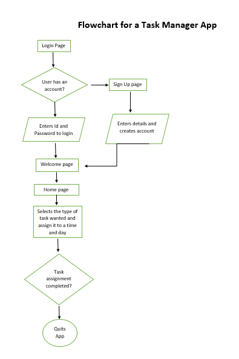

# Event Scheduler App

## Project Overview:
The Event Scheduler App is a web-based application designed to simplify event management and scheduling. Its primary purpose is to provide users with a convenient platform to create, manage, and coordinate events efficiently.

**Problem Solved/Value to Users:**
This project aims to solve the challenge of event organization by offering a user-friendly solution for creating, scheduling, and sharing events. It brings the following value to users:
- Streamlined event creation and management.
- Enhanced collaboration and communication among event participants.
- Real-time updates and reminders for upcoming events.
- Improved user experience and accessibility.

## Features and Functionality:
- User Registration and Authentication: Users can create accounts and log in securely.
- Event Creation: Users can create new events, specifying event details, dates, times, and locations.
- Event Management: Users can view, edit, and delete events they've created.
- Event Invitation: Users can invite others to participate in events.
- Notifications: Automatic event reminders and updates sent to participants.
- Event Sharing: Easily share event details with others via email or social media.
- Event Calendar: A visual calendar view to display all upcoming events.
- User Profiles: User profiles with personal information and event history.

## Technologies Used:
- HTML
- CSS
- JavaScript
- Python (Flask)
- SQLAlchemy (Database)
- Git and GitHub (Version Control)

## Screenshots or Demo:
- [Link to Live Demo](https://your-live-demo-url.com)
- 
- 

## Roadmap and Future Enhancements:
In the future, we plan to:
- Implement a messaging system for event communication.
- Enhance user profiles with customization options.
- Integrate location-based services for event mapping.
- Improve performance and scalability for handling large events.
- Support third-party calendar integration (e.g., Google Calendar).
- Develop a mobile app version for added convenience.

## Contact Information:
- **Your Name**
- GitHub: https://github.com/Dydex
- LinkedIn: https://www.linkedin.com/in/ajala-dolapo-756394281
- Email: supremeajala@gmail.com
